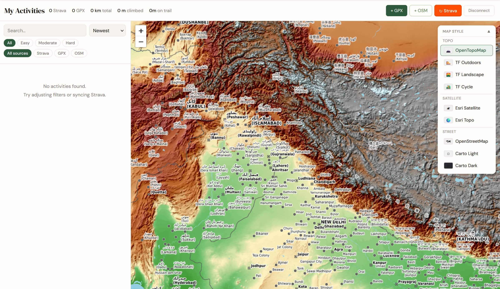

Most apps that track outdoor activity do one thing well and everything else poorly. Strava is great for social fitness but terrible for visualising a 17-day bicycle expedition across a mountain range. GPS apps fragment your tracks across devices and sessions. None of them let you overlay your own routes on a topographic map and actually *read* the terrain.

So I built my own.

## What it does

The Activity Dashboard is a single-page web application that pulls together all my outdoor activity — bicycle expeditions, hikes, trail runs — and displays them on an interactive map. Key features:

- **Strava integration** — imports all activities automatically via the Strava API, with GPS routes, distance, elevation, pace, and duration
- **GPX file import** — for activities not on Strava, including older expeditions and traces recorded with OsmAnd
- **9 switchable map layers** — including OpenTopoMap, Thunderforest Outdoors, ESRI Satellite, CartoDB, and OpenStreetMap, so you can see your routes against the terrain that matters
- **Elevation profiles** — per-activity charts showing ascent and descent
- **Filters** — by activity type, difficulty, and data source
- **Offline-capable** — data is cached locally so the map works without a constant connection

## Why I built it

I wanted one place where I could see all my activities on the same map, zoomable, layered against real topography. Something that would let me revisit a route and actually understand the landscape I moved through, not just see a coloured line on a grey background.

It is also a way of making my trails available to others. Anyone looking at a route I have done in the Kullu valley or Changthang can zoom in, see the terrain, and understand what the road or trail actually looks like.

## How it was built

The dashboard is a single HTML file — no framework, no build step, just vanilla JavaScript, CSS, and a few carefully chosen libraries:

- [**Leaflet.js**](https://leafletjs.com/) — for map rendering and layer management
- [**Strava API**](https://developers.strava.com/) — OAuth 2.0 authentication to pull activity data
- [**Thunderforest**](https://www.thunderforest.com/) — for the outdoor and cycling tile layers
- [**OpenTopoMap**](https://opentopomap.org/), ESRI, CartoDB, and OSM — free tile layers requiring no API key

The design principle was simplicity — a tool I would actually use, that loads fast, and does not require an internet connection once the data is cached.

## Status

The dashboard is live and accessible below. It is built as a standalone HTML file — no backend infrastructure, no framework, just a single page that loads fast and works on any device.

[Open the Activity Dashboard →](/hikes/)

*[Drop me a line](mailto:aman.malik@posteo.net) if you are interested in the code or want to build something similar.*
