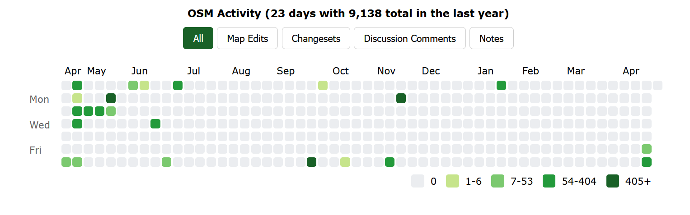
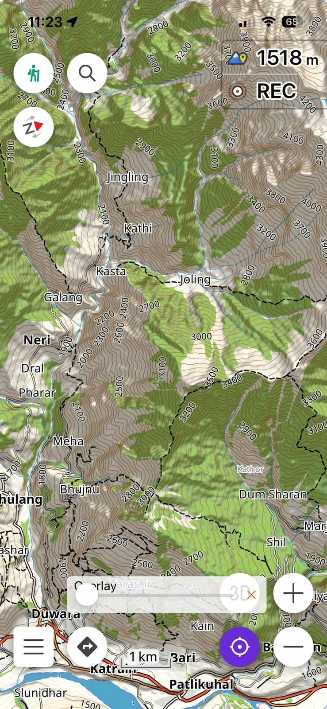
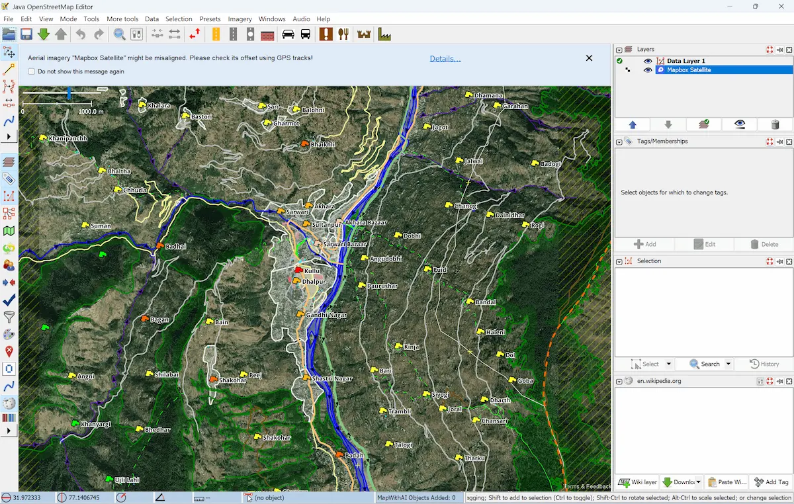

[OpenStreetMap](https://www.openstreetmap.org/user/amnmalik) (OSM) is the Wikipedia of maps — a free, editable map of the world built entirely by volunteers. I have been contributing since April 2020, with a focus on mapping trails, roads, and places in the Indian Himalayas and other areas I have travelled through.

## By the numbers

*Stats as of April 2026, sourced from [How did you contribute to OpenStreetMap?](https://hdyc.neis-one.org/?amnmalik)*

| | |
|---|---|
| **Member since** | April 2020 |
| **Mapping days** | 250 |
| **Total map changes** | 253,458 |
| **Changesets** | 1,118 |
| **Nodes created** | 193,480 |
| **Ways created** | 8,161 |
| **Countries mapped** | 13 |
| **Rank in India** | #580 |

## Where I map

The bulk of my contributions — over 251,000 changes — are in India, with a particular focus on the Kullu valley and surrounding areas in Himachal Pradesh, where I live. I have also mapped in Nepal, Germany, Sweden, Spain, Portugal, France, and several other countries visited during my bicycle expeditions.

My primary activity area covers the Kullu valley — trails, roads, villages, natural features, and infrastructure that are often missing or incomplete on commercial maps.

## What I map

Most of my edits focus on:

- **Trails and mountain paths** — particularly high-altitude routes in Himachal Pradesh that are essential for trekkers and locals but absent from most maps
- **Roads and highways** — surface tagging, connectivity, and accuracy in remote areas
- **Places and amenities** — villages, water sources, shelters, and points of interest
- **Natural features** — rivers, peaks, landuse, and terrain

## How I map

I map in two ways — as an armchair mapper and as a self-recorder in the field.

**Armchair mapping** means editing from a desk using openly available data sources rather than personal surveys. For this I rely on a combination of:

- **Satellite imagery** — openly licensed imagery from [ESRI](https://www.esri.com) and [Microsoft](https://www.microsoft.com/en-us/maps) available directly within OSM editors, useful for tracing roads, buildings, and landuse
- **Survey of India maps** — particularly useful for names and locations of villages, rivers, and peaks in India. Two excellent sources are the [SOI sheet index](https://ramseraph.github.io/opendata/maps/SOI/sheets) and the [SOI data archive](https://storage.googleapis.com/soi_data/index.html)
- **PMGSY road data** — the Pradhan Mantri Gram Sadak Yojana database of rural roads, which I have worked on integrating into OSM. See my [PMGSY-OSM integration project](https://github.com/amnmalik/PMGSY-OSM-road-integration) on GitHub
- **Public GPS traces** — recordings uploaded by other OSM contributors, available on the [OSM traces portal](https://www.openstreetmap.org/traces), which help verify road alignments and trail routes in areas with poor imagery

**Field recording** means going out with a GPS device and recording tracks directly on trails and roads I travel through — on foot, by bicycle, or by other means. These traces then become the basis for accurate trail mapping, particularly in high-altitude areas where satellite imagery resolution is poor and existing data is sparse.

## Tools

I primarily use:

- [**JOSM**](https://josm.openstreetmap.de/) — a powerful desktop editor, my main tool for complex edits (623 changesets)
- [**Go Map!!**](https://apps.apple.com/app/go-map/id592990211) — an iOS editor for on-the-go mapping (396 changesets)
- [**OsmAnd**](https://osmand.net/) — for navigation and recording GPS traces in the field (56 changesets)
- [**iD editor**](https://www.openstreetmap.org/edit) — the browser-based editor for quick edits (43 changesets)

## Get involved

If you're interested in contributing to OpenStreetMap — particularly in mapping the Himalayas — feel free to reach out. The [#kulluosm](https://www.openstreetmap.org) community is always looking for more mappers.

→ [View my OSM profile](https://www.openstreetmap.org/user/amnmalik)
