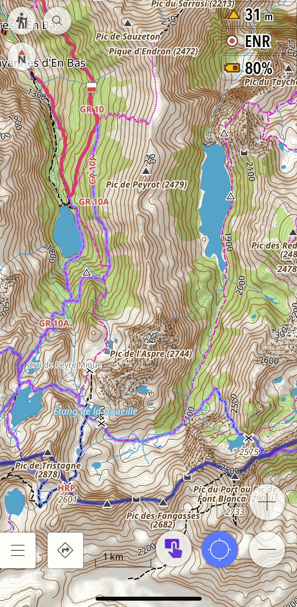
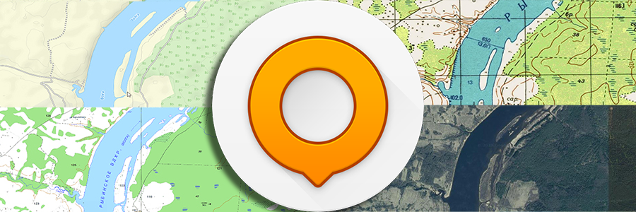

OsmAnd is one of the most powerful navigation apps available for offline use, and for hiking in India it is hard to beat. But out of the box, the default setup is not optimised for trails. After using it extensively on hikes in Himachal Pradesh, here are three features I have found genuinely useful - each one addresses a real gap in the default experience.

## 1. The Hiking Rendering Profile

The default OsmAnd map styles are designed for general navigation - they show roads and urban features prominently, but trails can be faint, poorly differentiated, and hard to read in the field. The [Hiking rendering profile](https://osmand-rendering.github.io/Hiking/index_EN.html#home) by OsmAnd-Rendering fixes this.

It is based on OsmAnd's built-in Topo style but significantly improves it for on-foot navigation:

- **Thicker paths and tracks** - trails are rendered more visibly against the terrain
- **Trail difficulty and visibility** - paths are colour-coded so you can see at a glance whether a route is a well-marked trail or a faint track
- **Useful POIs highlighted** - water sources, shelters, peaks, and other features relevant to hikers are made more prominent
- **Opaque route colouring based on OSMC symbols** - marked routes such as local hiking trails stand out clearly

This matters a lot in India because many of the trails in OSM in places like Himachal Pradesh or Uttarakhand are mapped but rendered invisibly on the default styles. The Hiking profile makes them usable.

**How to install:**

1. Download the profile file: [Hiking.osf](https://github.com/OsmAnd-Rendering/Hiking/raw/main/Hiking.osf)
2. Open the file on your phone - it will prompt you to open with OsmAnd
3. Check all boxes to import the Profile and rendering
4. Done - your new Hiking profile is ready to use

---

## 2. Offline Survey of India Topographic Maps

For hiking in the Indian Himalayas, the Survey of India 1:50,000 topographic maps are unmatched. They show contour lines, named villages, springs, temples, seasonal streams, and trail details that simply do not exist in any other freely available source.

These can be used as an overlay on top of OsmAnd's base map, giving you the OSM trail network combined with SOI's terrain detail - the best of both worlds.

I have written a detailed guide on how to download, process, and install these maps on OsmAnd here: [Survey of India Topo Maps on OsmAnd](/projects/soi-osmand/)

I have also made a pre-processed SQLitedb file available for **Kullu district** for those who don't want to go through the full workflow. You can download it directly from the project page above.

---

## 3. Satellite Imagery and Raster Maps via AnyGIS

OsmAnd comes with a limited set of online map sources by default. The [AnyGIS maps collection](https://anygis.ru/Web/Html/Osmand_en) dramatically expands this with dozens of additional raster map sources, including:

- **Satellite imagery** from multiple providers
- **Strava heatmaps** - showing popular cycling and running routes worldwide, useful for finding trails that are used but not yet mapped in OSM
- **OpenTopoMap, OpenCycleMap**, and many other specialist map types
- **Historic maps** and other niche sources

All of these can be used as underlays or overlays in OsmAnd, so you can toggle between a satellite view and the OSM base map while navigating.

**How to install:**

The AnyGIS website has detailed installation instructions for both Android and iPhone. The quickest method is to download the full pack as a zip file and copy the SQLitedb files to OsmAnd's map folder. Full instructions are on the [AnyGIS website](https://anygis.ru/Web/Html/Osmand_en).

---

These three features together make OsmAnd significantly more capable for hiking in India than it is out of the box. The Hiking profile improves readability, the SOI maps add terrain detail unavailable anywhere else, and AnyGIS adds the flexibility to switch between map types depending on what the terrain demands.
