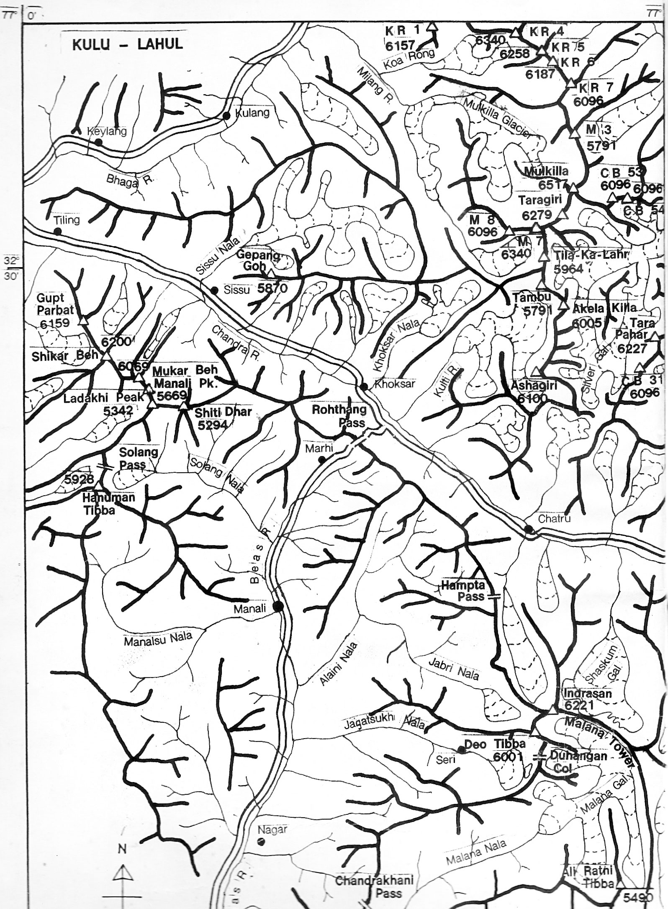
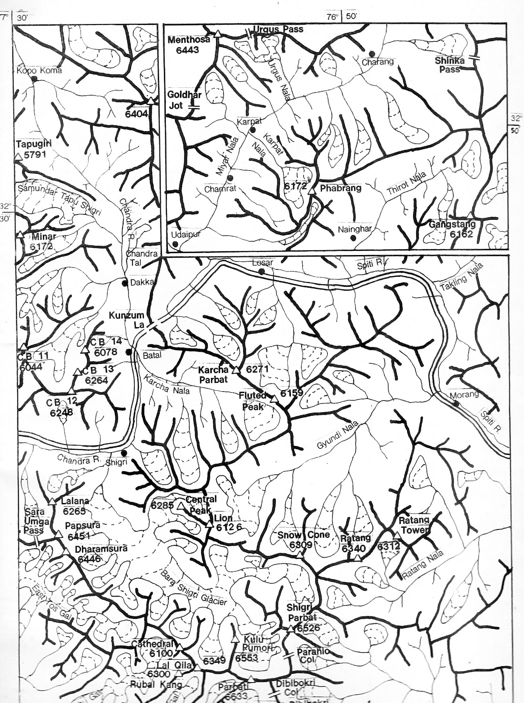
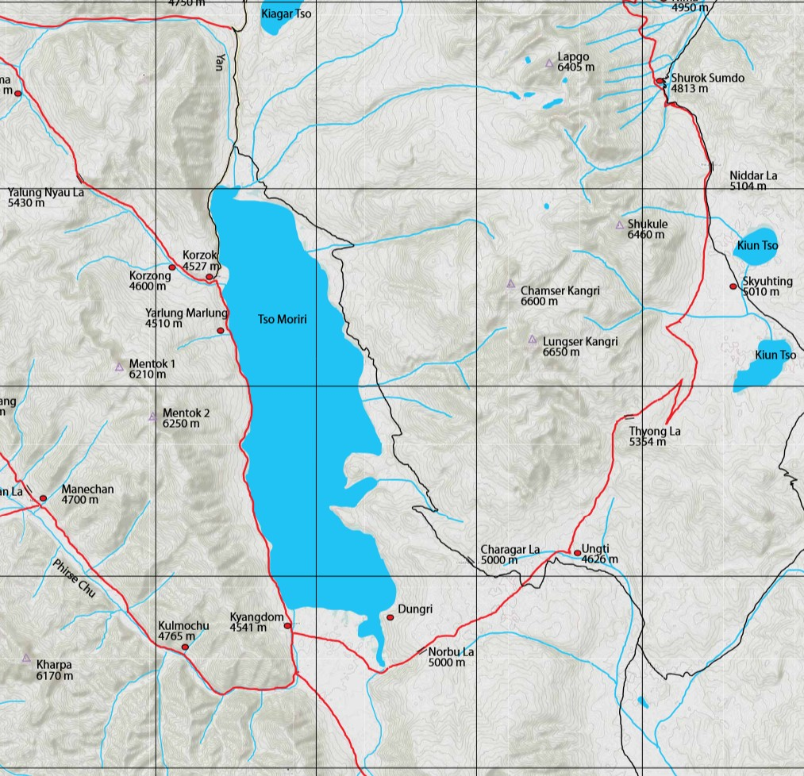
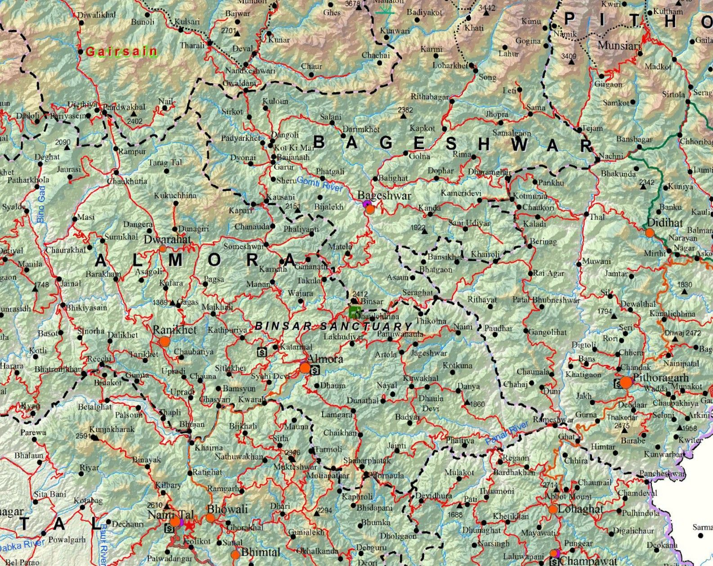

The topographic series — Survey of India, JOG, AMS, Genshtab — are the foundation for serious route planning. But they were made by governments for governments, and they show the landscape without much regard for how a trekker or climber actually moves through it. A separate tradition of maps has grown up alongside them, made by mountaineers and explorers who knew the terrain from the ground. These are less precise in an engineering sense but often more useful for understanding a route.

## [Harish Kapadia Maps](https://www.harishkapadia.com/climbs-explorations/)

  
  

Harish Kapadia spent decades exploring the Indian Himalaya — Spiti, Lahaul, Kullu, Kinnaur, Zanskar, the East Karakoram — and documented his routes in hand-drawn sketch maps that accompany his expedition reports. These are not topographic maps in the technical sense: they don't have contour intervals or precise coordinate grids. What they do have is the knowledge of someone who walked the ground, showing routes, passes, camps, glaciers, and peaks in a way that reflects actual travel rather than aerial survey.

The maps are organised by region on his website, with dedicated pages for each area he explored — Spiti-Lahaul, Kullu, Kinnaur, Zanskar, Ladakh-Kashmir, East Karakoram, Garhwal, Kumaun, Sikkim, and more. For any of these areas, his sketch maps are worth looking at alongside a topographic sheet, because they show where people actually went and what the key decision points on a route are.

A parallel and complementary collection is hosted by the Himalayan Club under the name of his son, Lt. Nawang Kapadia, who was also an accomplished mountaineer. The [Lt. Nawang Kapadia Map Collection](https://www.himalayanclub.org/resources/maps/) on the Himalayan Club website covers sixteen regions — Sikkim, Kumaun, Garhwal, Kinnaur, Spiti, Pin-Parvati, Kullu-Lahaul, Zanskar, Kishtwar, and the East Karakoram — and all maps are freely downloadable.

## [Depi Chaudhry — HimalayaMaps.com](https://www.depichaudhry.com/)

Depi Chaudhry is a trekker, cyclist, and author who came to mapmaking out of frustration with what existed. As he put it at the launch of his map at the Indian Mountaineering Foundation in Delhi: "If someone had a Survey of India map, I would go running to that person, scan bits of it, and try to stitch it together. It used to be a struggle each time you tried planning a trek. There were limitations — if we looked at going from 3000m to 4000m, it would be a straight line."

He is also the author of *Trekking in Western Himalaya* (Collins), and the maps reflect the same ground-level knowledge that went into the book. Digital versions were intended to be available through [HimalayaMaps.com](http://HimalayaMaps.com), though as of May 2026 the site appears to be down. A low-resolution preview of the full map is available to [download here](https://pub-aba69cd42a7b4d7aa8b5444fae551046.r2.dev/other-maps/Himalaya%20Trek%20Map%20-%20low%20res.pdf). If you need the high-resolution version (~400 MB) or a georeferenced version suitable for use in QGIS or OsmAnd, feel free to [get in touch](mailto:aman.malik@posteo.net).

Depi has also shared GPX tracks for almost all the treks covered by his map — [browse and download them here](/depi-gpx/). Almost all of these routes have also been traced onto OpenStreetMap, so they are visible in any app that uses OSM data — including OsmAnd — without needing to load the GPX separately. Both the map and the GPX files are shared courtesy of Depi Chaudhry.

## [Improved Uttarakhand Map — Pahar](https://pahar.in/improved-uttarakhand-map/)

For Uttarakhand specifically, Pahar has produced an improved trekking map that consolidates and corrects trail information across the region. It is one of the better freely available resources for planning routes in Garhwal and Kumaun — areas where the SOI sheets are useful but where trail information on the ground can be patchy.

The map is available as a [zipped tile package for download here](https://pub-aba69cd42a7b4d7aa8b5444fae551046.r2.dev/other-maps/Pahar_UK.zip). Unzip it and open in Google Earth — it will load as an overlay directly. The original page on the Pahar website is [here](https://pahar.in/improved-uttarakhand-map/) but the map isn't available there as of May 2026.

## [Pahar Maps Archive](https://pahar.in/maps/)

Pahar is a mountaineering and trekking resource site that maintains an extensive archive of historical maps of the Indian Himalaya. The collection draws on older sources — expedition maps, alpine club publications, and maps that have been scanned and made available digitally. For areas with thin coverage in the modern topographic series, or for understanding historical routes and place names, it is worth browsing. The archive spans most of the major ranges and is freely accessible.

---

*This post is a companion to my [overview of topographic map series](/projects/topomaps-himalaya/) covering the Survey of India, JOG, AMS, and Soviet Genshtab maps. The two together should give a reasonable picture of what is available for route planning in the Indian Himalaya.*
