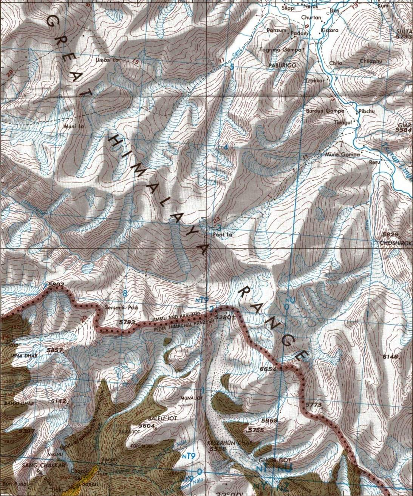
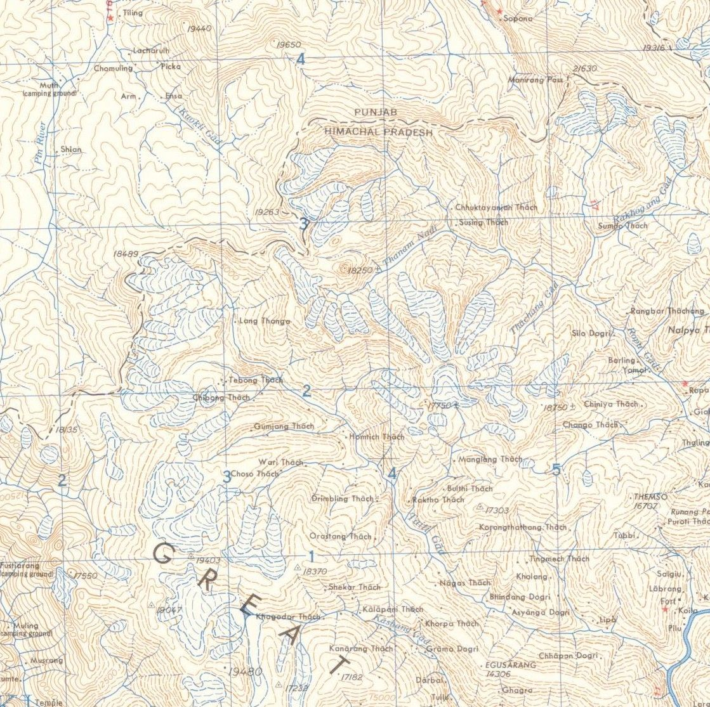
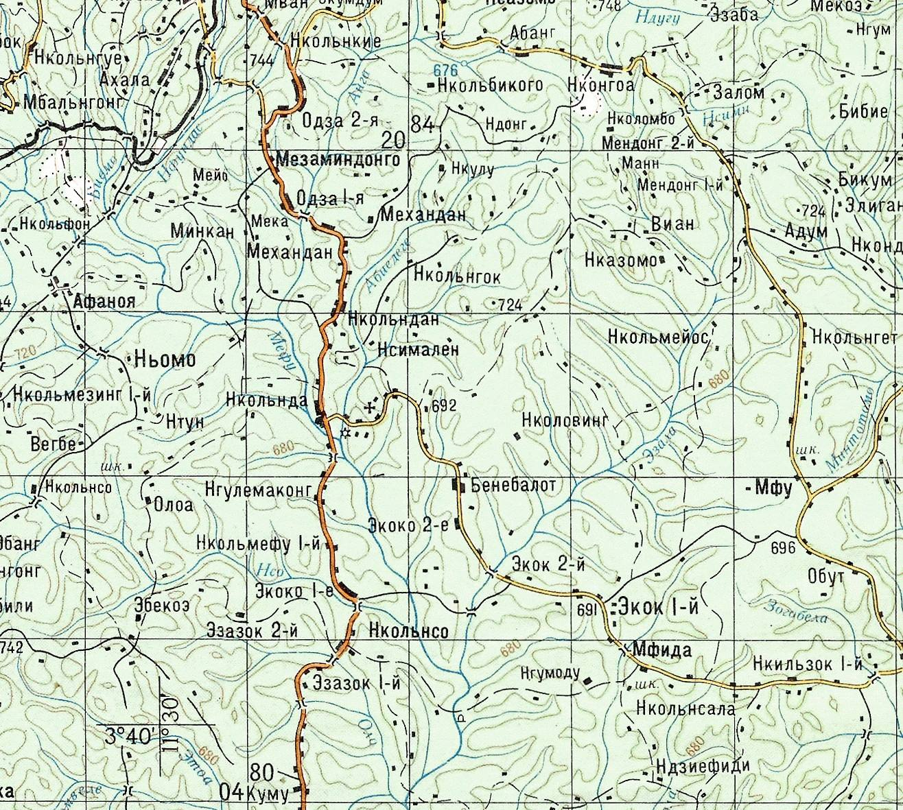
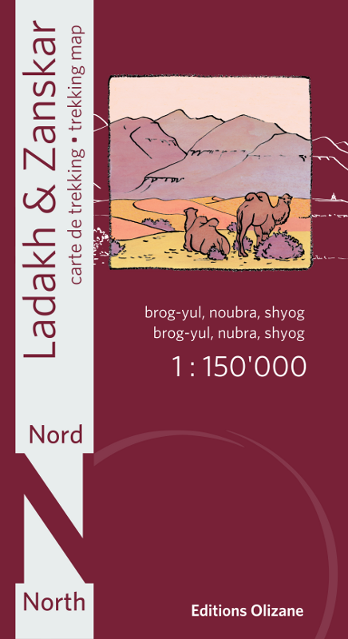
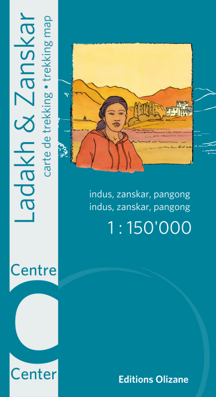
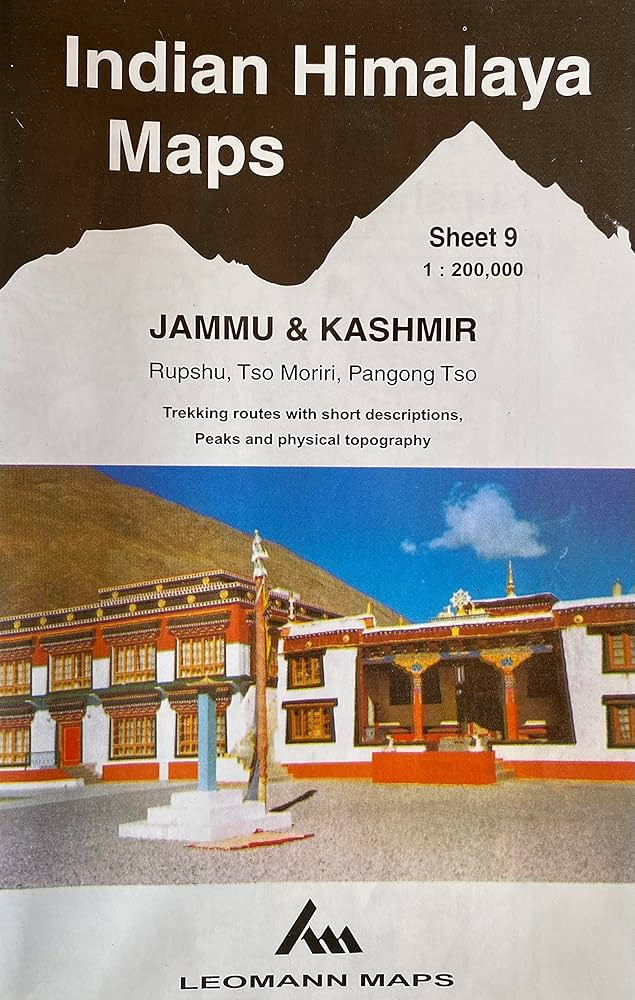
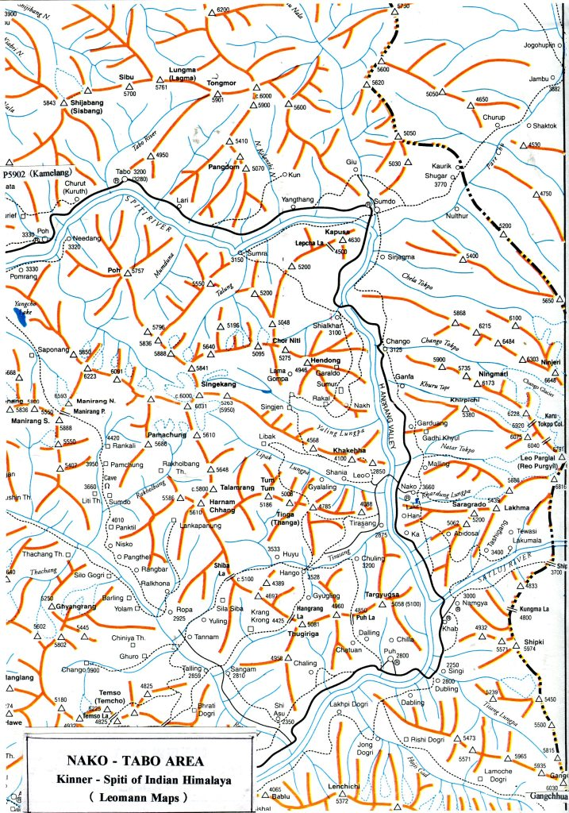

If you spend any time trying to explore a route into a less-visited corner of the Indian Himalaya, you quickly run into the limits of what Google Maps and OpenStreetMap can tell you. Satellite imagery is useful in spotting trails but has its limitations in terms of resolution, terrain (difficult to detect in forests), and discontinuity (trails routinely disappear). This is where the topographic paper map series become genuinely useful, for they not only show trails, but names and location of natural features (like springs, waterfalls, caves, boulders, cliffs) as well as human-made features like ruins and mills. Over the past couple of years I've been collecting and georeferencing as many of them as I can get hold of. Mind you, the location of trails on these maps might not be accurate so don't follow them blindly.

What follows is a summary of the main sources I know about, covering maps at 1:250,000 scale or better - anything coarser than that isn't much help on the ground.

## [Survey of India - Free](/projects/soi-osmand/)

The Survey of India (SOI) topographic series is the gold standard for the region. Produced by the Survey of India, these come in two scales: the 1:50,000 sheets, and are extraordinarily detailed, and the (more recent) 1:25,000 sheets, which go even finer and cover parts of the country at near-engineering survey quality. The 1:50K include besides trails (that are marked in red dots) - show meadows, waterfalls, peaks, rivers and streams, ridges and contour lines, protected and reserved forests etc. The 1:25K sheets were produced as part of the National Hydrology Project (NHP), with the main aim of informing local stakeholders in flood assessment, mapping etc and therefore don't have all the features of the standard 1:50K maps and don't extend to the whole country. They however do have trails, peaks, and camping spots. Some trails that show on 1:25K are not shown on 1:50K and that's what makes them useful for exploration.

I've written a detailed [blog post](//projects/soi-osmand/) on how to get the 1:50K maps on your phone and there also provided a link to a ready-to-use file for Kullu district in Himachal (for use on OsmAnd).

## [Joint Operations Graphics (JOG) - Free](https://github.com/ramSeraph/american_world_topo_maps)

The JOG series was produced by the US Defense Mapping Agency (now NGA) as a global 1:250,000 military topographic series. They are freely available - the US government declassified them and they can be downloaded from various archives.

The cartography is clean and consistent: contour intervals of 100m, with form lines at 50m in gentler terrain. Roads, trails, rivers, settlements, and vegetation cover are all shown. The quality of ground-truth for the Indian Himalaya varies - some sheets are clearly based on aerial photography and are quite accurate, others show the limits of what could be mapped from a distance during the Cold War period.

The georeferenced and tiled versions of the JOG sheets - are available from [The Kansas University Library](https://libgis.ku.edu/jogs/). Also see [ramSeraph's american_world_topo_maps repository](https://github.com/ramSeraph/american_world_topo_maps) on GitHub.

## [American Map Service (AMS) - Free](https://github.com/ramSeraph/american_world_topo_maps)

The AMS series, also at 1:250,000, predates the JOG and was the earlier US military mapping effort covering much of the world. For India, these are sometimes referred to as the Series U502 maps. The style is similar to JOG but the ground data is older, often from the 1950s and 1960s, which in some parts of the Himalaya actually means less road infrastructure shown and more of the traditional trail network still visible.

The AMS and JOG sheets are close enough in scale and style that for most purposes you can use them interchangeably, picking whichever has better coverage for your area. The georeferenced tiles for both series are in the same [repository](https://github.com/ramSeraph/american_world_topo_maps).

## [Soviet Genshtab Maps - Free](https://github.com/ramSeraph/russian_world_topo_maps)

The Soviet military mapping programme - Генштаб, usually transliterated as Genshtab - produced topographic maps of essentially the entire world at multiple scales, as part of a systematic Cold War intelligence effort. For the Indian Himalaya, the most useful scale is 1:200,000, which gives slightly more detail than the JOG/AMS series. There are also 1:100,000 and higher resolution sheets but don't cover India.

The Genshtab maps have a following among serious mountain travellers and GIS people for a few reasons. The cartography is detailed and the maps were updated more regularly than many Western equivalents. They show land cover - forest, scrub, bare rock, glacier - with a level of care that the AMS sheets don't match. The main limitation is that they're in Russian, which takes some getting used to, though the symbology is consistent enough that you can work it out fairly quickly.

The georeferenced versions, tiled and ready for use, are available from [ramSeraph's russian_world_topo_maps repository](https://github.com/ramSeraph/russian_world_topo_maps). 

## [Olizane Maps - Paid](http://www.abram.ch/lzmmaps.php)

  
  

Editions Olizane is a Geneva-based publisher that has produced a series of trekking maps covering Ladakh and Zanskar at 1:150,000. These are **commercial maps**, designed for the trekking market, and compared to the military series they have a very different character - clearer layout, modern printing, contours at 100m intervals derived from satellite data, and the key trekking routes marked explicitly.

The limitation is that Olizane's coverage is concentrated on Ladakh - the map series doesn't extend into Himachal Pradesh or Uttarakhand in any serious way, which is a gap if you're working further south and east. They're also showing their age in places: the third edition came out in 2013, and trail conditions and settlements have changed since then in parts of the region.

## [Leomann Maps - Paid](https://www.mapsworldwide.com/leomann-maps-m228?ayh_access=SY3RkAVCwZ8dEsHl)

  
  

Leomann is a British publisher that produced a series of maps of the Indian Himalaya at roughly 1:200,000-250,000 scale. Their style is distinctive: instead of conventional contour lines, they use a ridge-line drawing approach, showing the mountain topography through hand-drawn representations of spurs, ridges and valleys. Peaks and passes are marked with spot heights.

This makes Leomann maps visually expressive and quite good for understanding the overall structure of a mountain group, but less precise for navigation than a contour map. They're trekking maps rather than topographic maps in the strict sense - the back of each sheet has written route descriptions and area information. Coverage includes Jammu and Kashmir, Ladakh, Himachal Pradesh, and some cross-border areas into Pakistan.

They're getting harder to find in print, and as older publications the content doesn't reflect recent changes in road access and settlement.

## Getting Them Onto Your Phone

All of these maps were originally only available as paper maps. This meant that to get them on your phone app, you first had to scan them (either in parts or together using large scanners), then georeference them digitally (convert points on the map to actual geo-location — done either using QGIS manually or, if you are technically inclined, by writing code that automates it), then convert them into a format accepted by the phone app. For OsmAnd this means converting to MBTiles or a similar format, and then to SQLite DB.

[Sreeram](https://github.com/ramSeraph/india_topo_maps) has already georeferenced Survey of India, AMS, JOG, and Russian maps and these are available for download on the linked website. The tricky part is selecting only your area of interest. For Survey of India maps, I've [written a guide on how to do so](/projects/soi-osmand/) and a similar procedure can be followed for the other map series.

Both Olizane and Leomann maps are commercial and require you to purchase the paper maps first, then georeference them yourself. The procedure isn't hard but is time-consuming. If you need help, feel free to reach out.

