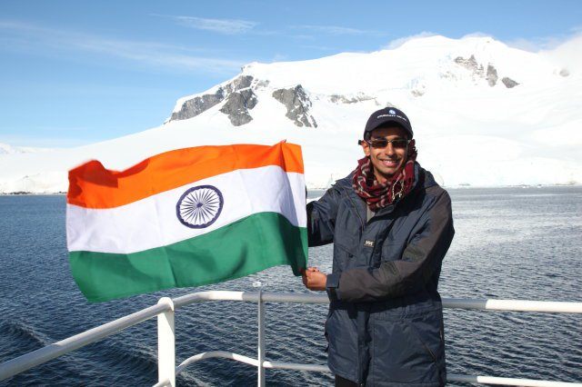
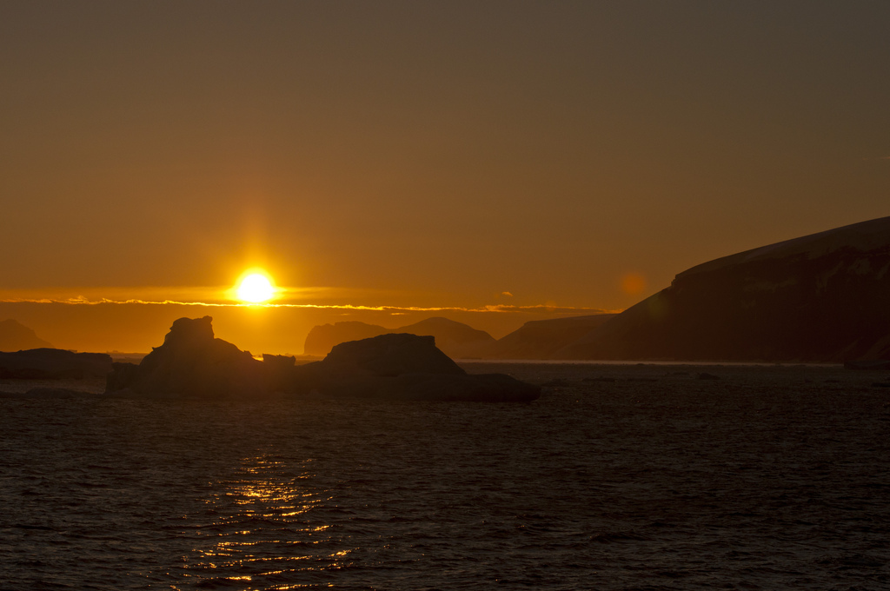
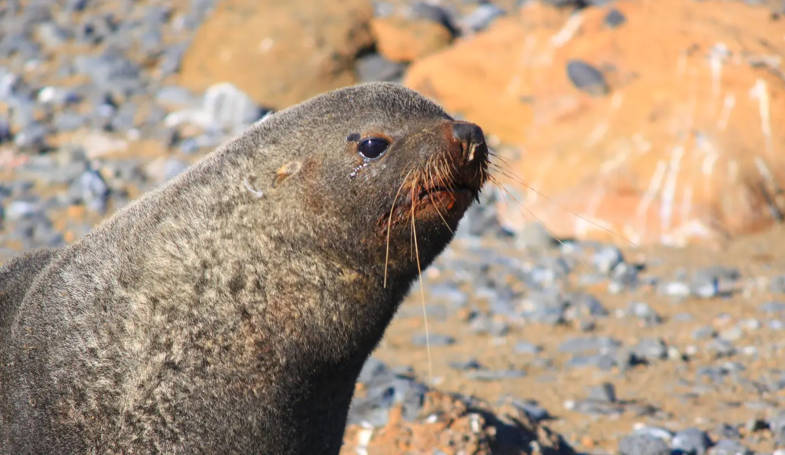
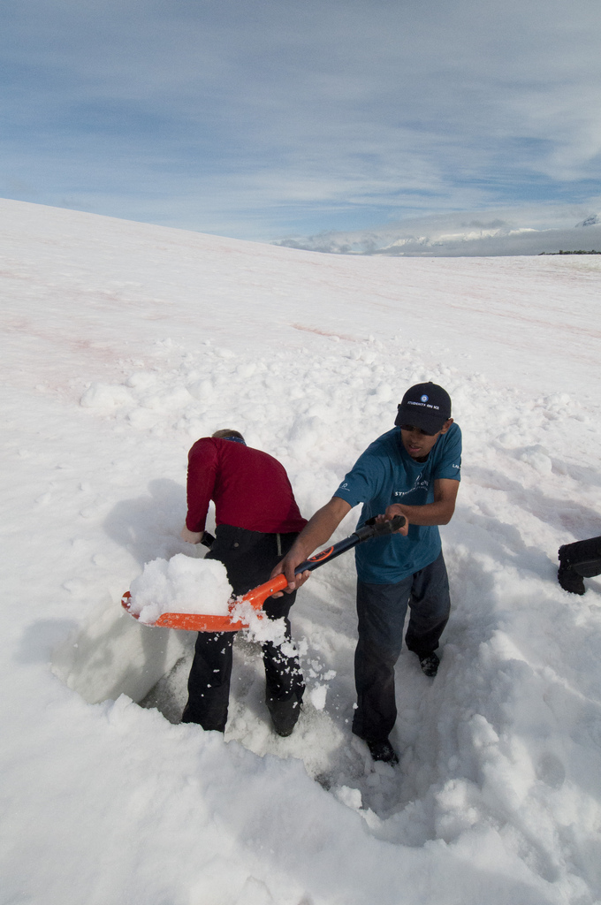
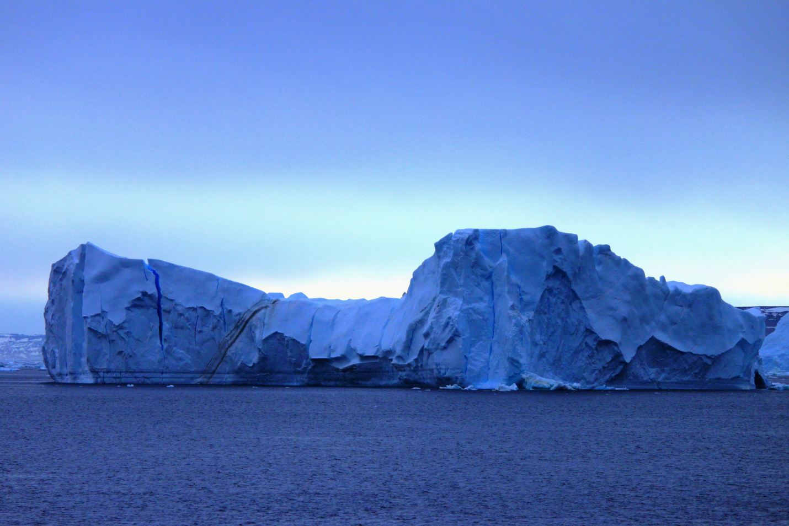

On 14 February 2011, I was one of 53 students selected from around the world to participate in the 'Students on Ice' educational expedition to Antarctica. The mandate of this organisation is to take young students to the Polar Regions and through the process of learning, discovery and exploration create new Polar ambassadors — students who in the future will influence the Polar Regions through science, policy and education.

We were accompanied by a group of 33 staff members which included polar historians, environmental scientists, educators, researchers, engineers and politicians from some of the leading universities and organisations in the world — the Canadian Polar Commission, McGill University, Carleton University, UCLA, UNEP, Canadian Museum of Nature, University of St. Andrews, University of Ottawa.

The departing point for our team of 86 members was Ushuaia, Argentina, also dubbed the southernmost city in the world. For the next 11 days our home would be the ship M/V Ushuaia. This ice class ship was made for the NOAA and after serving for many years was bought out by an Argentine company. Antarctica is surrounded by water from all sides and Ushuaia is the closest land-port from where ships can set sail and cover the distance of around 1,000 km to the mainland.

The following day was spent in the city where we had expedition briefings, ice-breaker activities and introductory lectures on climatology and oceanography, Antarctic glaciers and the Antarctic Treaty System. India is one of the 28 countries to ratify the treaty and has shown interest in Antarctica through research activities done at its permanent research station at Maitri. India is also constructing a new research station in Larsemann Hills named 'Bharti'. A field trip was also organised to Laguna Esmeralda, a beautiful glacier lake surrounded by mountains.

## Setting Sail

On the morning of the 16th, with perfect weather conditions, we set sail for Antarctica. Our journey would involve crossing the Beagle Channel and then officially entering the Southern Ocean into a region known as the Drake Passage. The Drake Passage is known to be one of the roughest seas in the world. The Antarctic Circumpolar Current runs around Antarctica unobstructed by land, however when it encounters this shallow pathway between South America and the Antarctic mainland it tries to squeeze through and in the process creates rough seas. This time around we were lucky to find relatively calm waters — which meant 4-5 metre high waves and wind speed approaching 65-72 km/hr. Though the outside temperature almost never dipped below 2 degrees, with wind chill it felt like -12 degrees.

Our daily schedule included course meetings, presentations on different areas like sea birds, marine mammals, dynamics of Antarctica ice sheets, and workshops where we discussed different issues related to Antarctica and scientific research. All these activities took place on the ship. What I learned from these programmes was the uniqueness of Antarctica in almost every aspect, ranging from its late discovery to its harsh climate. Antarctica is a symbol of hope and its designation as a place only for peace and science stands as a testimony of the combined human spirit to do better for the planet.

## First Landing

At last on the morning of the 19th the desolation of the sea ended and we first spotted an iceberg and soon after — land.

Our first landing was on Seymour Island (64°14′S, 56°37′W) located in the eastern part of the Antarctic Peninsula. This tiny island is one of only 20 locations in the world where one can still see the K/T boundary — the Cretaceous-Tertiary boundary. We were amazed to find fully preserved fossils of trees, mollusks and bivalves. Our next landing was on Brown Bluff (63°32'S, 56°55'W) which was special because it was on the Antarctic mainland proper. It was here that we first met a large number of Adelie and Gentoo penguins and fur seals.

A set of visitor guidelines has been maintained in the Antarctic Treaty which provides guidance on how humans should interact with the wildlife and vegetation in different areas. All the students were under strict supervision of guides. The Glaciology group, which included me, went off to a permanent glacier nearby and studied some of the peculiar things we observed about glaciers in this area, including high surface water melt and large numbers of rock debris scattered along the surface. We then went for a zodiac cruise along the glacier boundary and amidst large icebergs which had been grounded.

## The Days That Followed

In the following days we landed on different parts of the Antarctic Peninsula — Ronge Island where we dug our first snow pits and analysed the temperature gradient and structure and density of the snow, Neko Harbor where we first dug ice cores to understand accumulation rates and packing of snow, Almirante Brown station, Port Lockroy on Goudier Island (a British heritage museum), Jougla Point, Deception Island and Robert Island.

The Marine Mammal Group studied predator ecology and did bird and mammal surveys; the Oceanography students did conductivity, temperature and density profiles of the ocean; others observed samples of zooplanktons and the impact of humans on the wildlife and vegetation. When the weather did not permit landing, we had a continuous session of workshops and presentations by the staff on board. My personal favourite was the adventures of Ernest Shackleton on his ship 'The Endurance' — an epic saga of the human spirit and how he managed to save all his fellow companions after their main ship was crushed by sea ice in the Weddell Sea.

He was one of the many people who comprised the Heroic Age, a time when explorers and sailors from around the world were discovering different parts of Antarctica. Some of them had territorial pursuits in mind, some conducted scientific research, while others — mostly sealers and whalers — went to extract oil from whales. However, what binds all these people together are feelings of extremity towards Antarctica. It is one of the last few surviving wildernesses on Earth, a land where nature reigns, and whose vastness makes you feel utterly small and worthless.

We talked in detail about the impact of climate change on Antarctica in the future. The East Antarctica ice sheet seems very stable but it is the West part that we are particularly concerned about. The recent collapse of the gigantic Larsen B ice shelf, shifts in the population of certain penguin species, and the retreat of glaciers are some of the indicators of our impact on this pristine continent. It doesn't matter in which corner of the world we live — the Polar Regions are an integral part of our lives.
