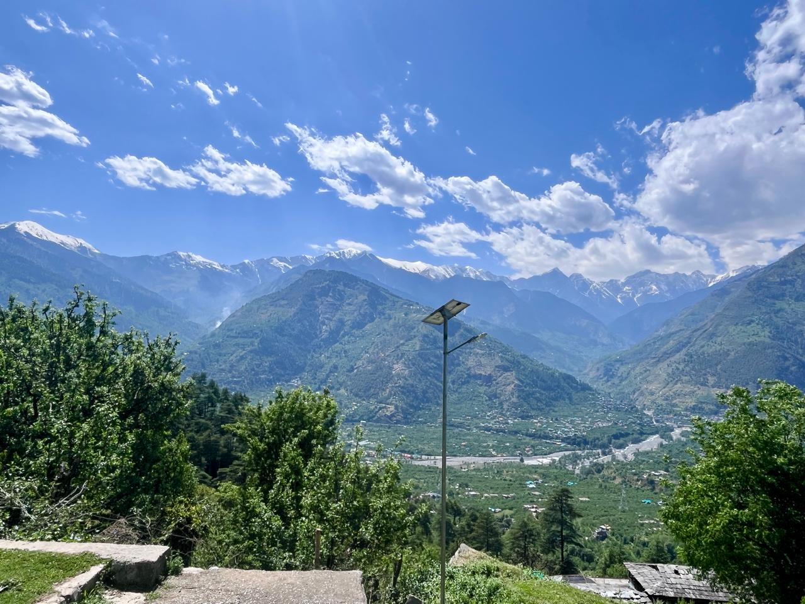
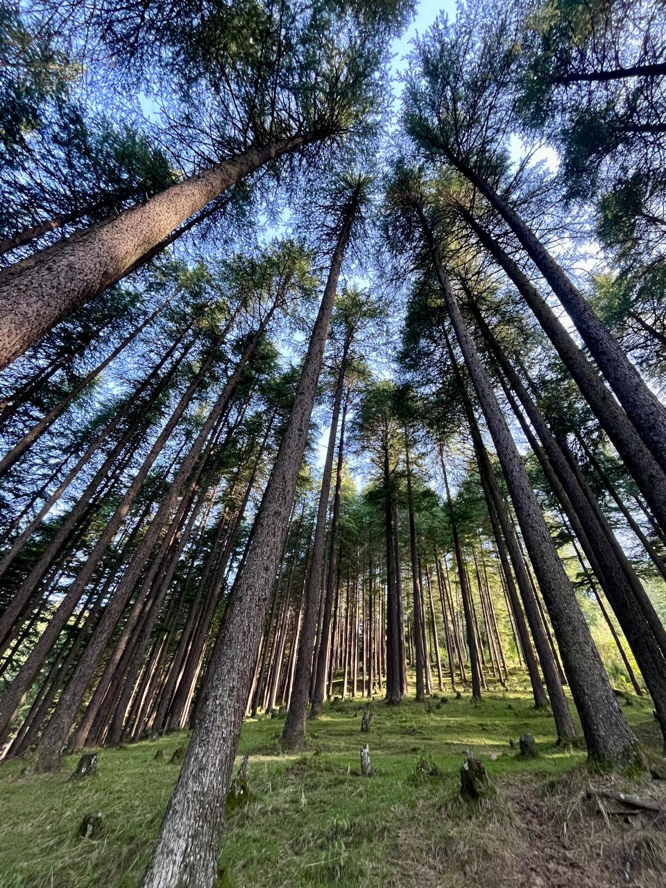
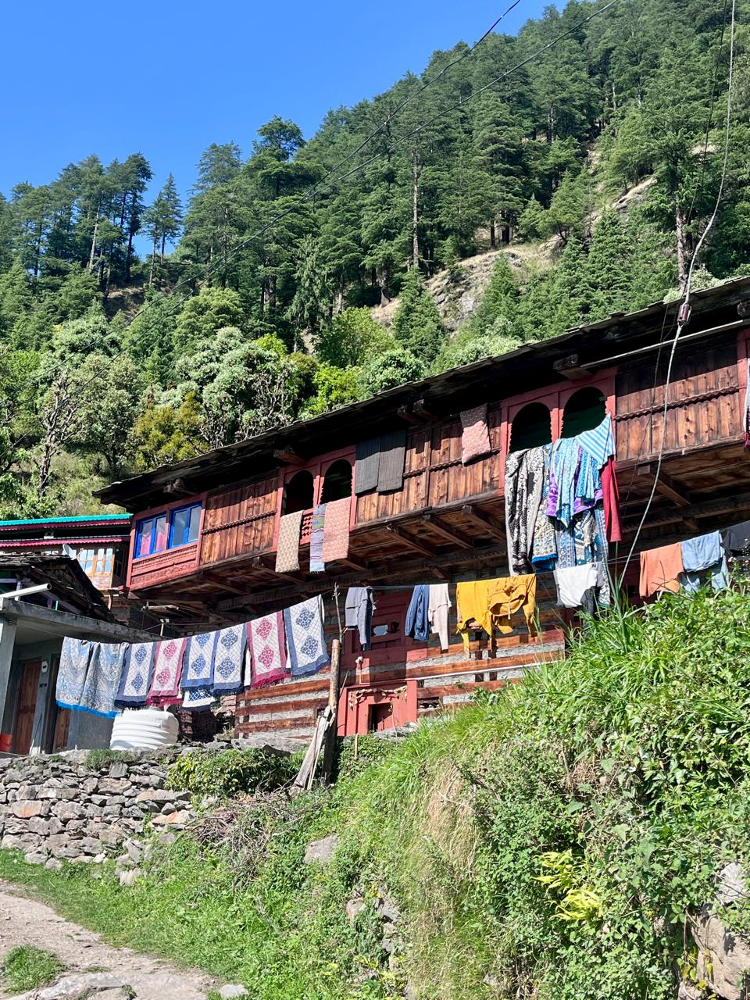
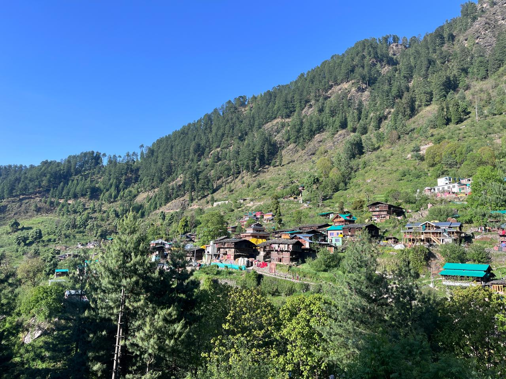
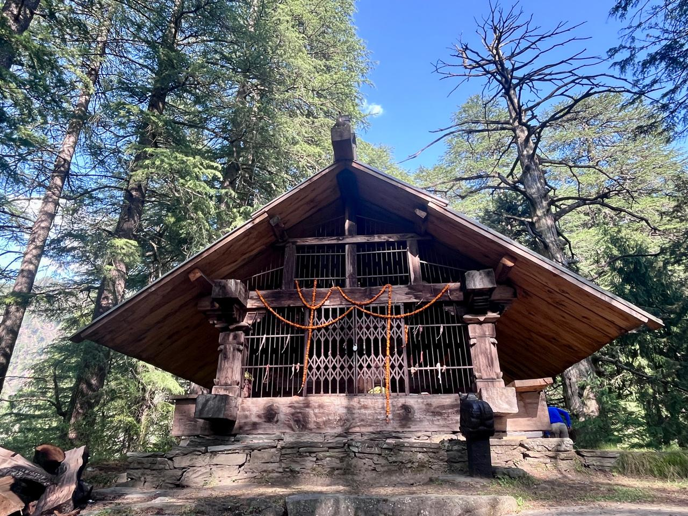
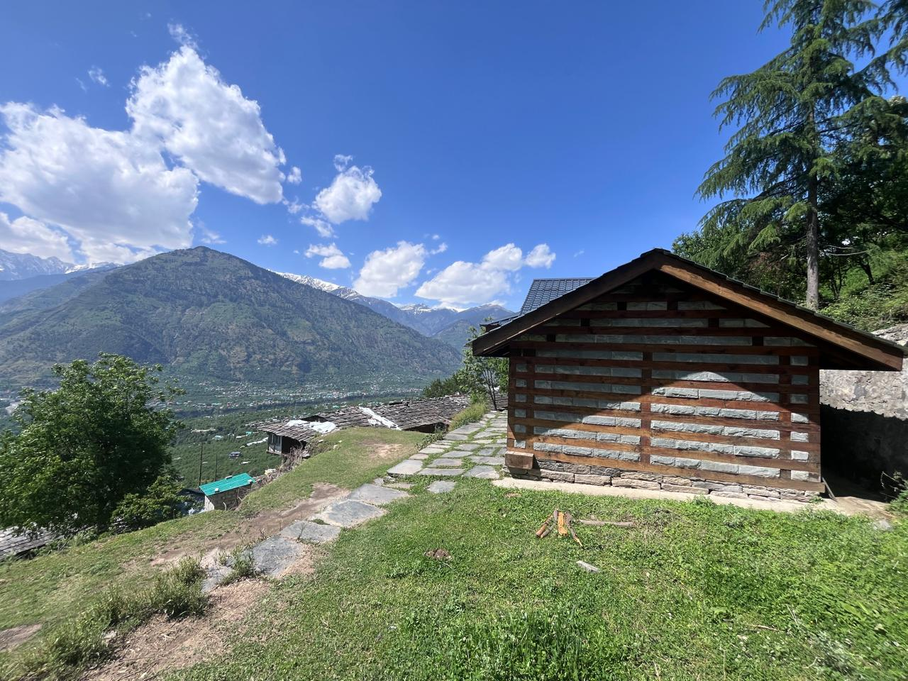

The *Beas River* bisects the Kullu valley into two - the area to the left of the river's flow is known as the Left Bank, and the opposite side as the Right Bank. My village is on the Right Bank, so my excursions into the villages and forests on the Left Bank are far fewer than I would like. Typical of the grass feeling greener on the other side, the forests between Naggar and Jana look very inviting, especially going all the way to the ridge line connecting the famous Chandra Khani Pass to Bijli Mahadev. In fact, on two separate occasions I've tried to find a route going from Raison (Right Bank) to the ridge line, and then further north to Chandra Khani - but both times I've either lost my way or retreated on seeing too much snow up the north western slopes (but more on that later). To add to the mystery, on OpenStreetMap, the density of trails criss-crossing the landscape is far less than on the Right Bank. Yes, the topography is steeper and looks less inhabited - but the truth is, it is also less explored.

So on Sunday, I decided to do just that. I left home around 1:30 and by 1:50, I was in Hirni. From the bridge, I took the road going in and drove all the way to the end of the road to the village of Posha (wrongly marked as Shar Patka on OSM). The stream here was full of trash and as always when I see trash in beautiful surroundings - I feel such a deep sense of pain and loss. Then comes the anger and the frustration of not doing anything to solve the issue, or realising that there are thousands of villages like this alone in Himachal Pradesh where a similar problem is unfolding. It will only get worse as road access increases and people become wealthier to afford the "things from the market covered with plastic". Unlike my village that's big enough and accessible enough so that at least some waste can be sold to the recyclers who come now and then - they take away glass, aluminum, plastic bottles, cardboards - no recycler comes to remote areas and people do not consider bringing the waste to the road. Anyway, waste is a separate and big issue in itself.

I followed the trail going up adjacent to the water pipe and soon found myself at the temple of Baranigran. The temple was a simple structure of neatly laid wood and stones - quite a simple affair compared to the richly adorned new temples being built in numerous villages of Kullu. Villages seem to be in a building spree, with one being built in my own village. What I found quite astonishing was that most of the artisans come from the area around Thachi, and secondly that most of the cutting is not done manually any more but with machines - you simply give the design and it cuts like a laser. Thachi, part of the Mandi district, is known for generations of Lohar (blacksmith) and Barai (carpenter) families. But this austere-looking temple, built in 2022 and dedicated to God Narayan, looked regal in these surroundings. To the opposite side, the valleys of Shirar and Phojal were visible going all the way to the passes on the Shirar side, flanked to the south by Chaplang Tibba, and on the much larger Fojal side the peaks of Ghoda Lotnu and Khaljundu Tibba.

Going further up and away from the stream that I was following, I reached the Naggar-Jana road. Dense Deodar trees surround the road looking stately and serene. But as I looked for shortcuts to skip the long bend in the road, I came across more trash thrown down the steep face of the nearby stream. I found a shortcut through an orchard that joined the trail going to Nathan.

Nathan is a beautiful village containing dozens of old kath kuni houses, with their typical "floating in the air" balconies and arched lookout points. Many of the archways are coloured an ochre red - might this be the red soil that is used throughout the valley? Clothes and blankets hang out to dry, women comb their long wet hair glistening in the sun, and cows chomp through their straw. The village looks very idyllic, nestled solitarily in the valley. From there I wanted to explore the village of Shansher that's marked on OSM, and asked someone for directions. They only knew of a temple and told me to go further up, where I'd find a dirt track - follow it until a big stone and then turn into the forest.

The temple dedicated to God Karthik was closed but I could peek through the gate. It contained polished stone sculptures of Ganesha, Parvati, Shiva and a few other gods - the whole family. They looked to have been polished recently, the figures clearer than other idols I've seen before. Outside the temple near the entrance was a statue, presumably Nandi. On the eastern side were two stone structures resembling a stairway-type pagoda, with a small oval shape - presumably a linga - on top. A small Nandi was nestled in between the structures. From the shape of it, they looked as though they would have rested on top of an older temple before this current one was built. I sat for some time absorbing the quiet environment before moving on to explore other nearby trails.

Two of the trails were not promising - either passing through private orchards or becoming fainter as I went deeper into the forest. I eventually decided to take the trail further up back to Nathan. From there I followed the road going to Jana for some time, then took a shortcut to reach the same road lower down and eventually back to the village of Baranigran. From there I walked on the trail to reach the nearby village of Laran, some ten minutes away, before backtracking to Baranigran through another route. Then I descended to Posha and drove back home.

---

*This hike was recorded on Strava — [view the activity](https://www.strava.com/activities/18270684192).*
