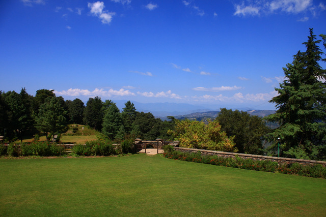
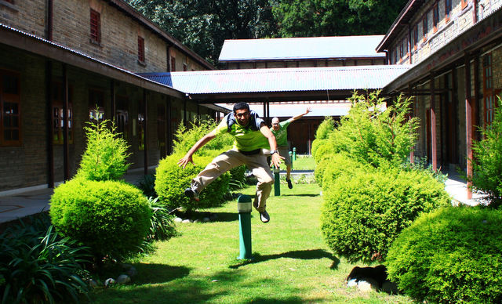
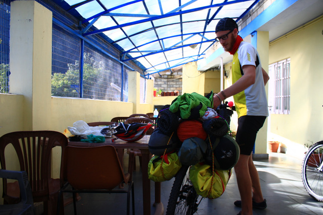
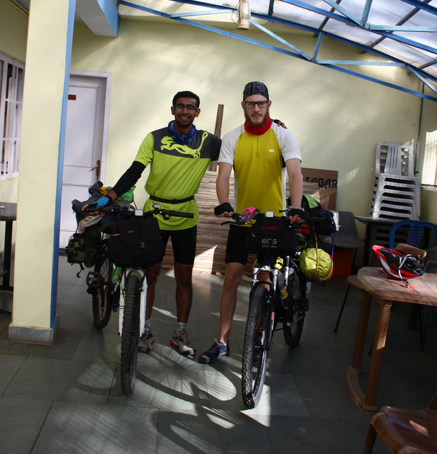

*Tom Henbest and I had met in 2011 in Argentina as part of the Students on Ice Antarctic expedition. After 30 long months we were partaking in another adventure — bicycling a portion of the Indian Himalayas from Shimla to Keylong, a distance of some 1,000 km.*

---

## Day 1 — Shimla: All is Not Well

The piercing radiance of the rising sun stirred the inhabitants of the valley into motion, motion towards finding shade. I felt the heat on my face, something burning on my head, but was quite unperturbed. Greater things were going on in my mind; there was a greater cause to worry.

Our arrival in Shimla brought a bitter surprise. I had forgotten the quick-release for the front wheel of my bicycle — a part connecting the wheel to the main body — along with my cycling shorts. While Tom was sure my other shorts would work, I was missing them dearly. All my trips were made on that tiny piece of cloth that always clung close to my body, bearing my sweat and the constant commotion it was always in. I could not leave it deserted in this adventure of mine. I could not betray it.

After finding a temporary fixture to the quick-release problem we rolled our cycles onto the streets of Shimla, on the famous Mall Road searching for Hotel Satkar, associated with the Youth Hostels Association of India. While young children hopped and skipped on their way to school and monkeys went scampering through the bins, we paraded rather dryly towards Lakkar Bazaar, the location of the hotel. The staff seemed warm and welcoming. Bicycles were kept on the first floor and tea was served as we sat on a narrow veranda overlooking the valley.

It was quite a sight and I wished I could enjoy it more. I was looking at the mountains but not observing them. Tom's voice woke me up. "Where is the sound of the drum beats coming from?" "Ah!" I replied. "That must be early morning marching in a school!" This immediately brought back memories of me leading the marching contingent of my house at school.

I was not only caged in thoughts that attached me back home but I could see loads of uncertainties associated with this trip — not entirely about our preparedness but more so about my own capabilities of doing something like this. The only appreciable amount of cycling I had done in the past five months was back in Holland, just before arriving in Delhi.

Tom rolled a towel on his bald head and was looking like a Sheikh. That made me realise how hot my own head had become. I was in search of shade from there on.

As the morning pressed on, a trickle of good news came in. My father said he could send my stuff from Delhi on the next bus to Shimla. On the streets, shutters were drawn up and out came the merchants — socks, traditional jackets, jewellery and other exotic items hung outside for display. The food stalls with their large pans bubbled with oil and smoke like a diesel engine ready to chug off. The pan hissed and jumped when raw tikki dumplings were put into it, like the fleeing residents of Manhattan on seeing Godzilla. Handshakes, far-off smiles, hearty laughter and fresh gossip were in the air. The part of my mind concerned with one major problem immediately emptied and made space to appreciate these things around me.

We then went to the Deputy Commissioner's office to get permits for Tom. Foreign nationals travelling to areas bordering China must get inner line permits. After crossing the labyrinth of the DC office we reached the concerned department only to be told that the SDM who would sign the permits was away, and that applications were processed only in groups of four. The person at the Himachal Tourism office suggested we get the permits at Reckong Peo, where there would certainly be more foreigners.

Later we met my classmate Shreya, who was in Shimla for vacations. She helped us secure a few supplies — dry fruits, sunscreen, tea, biscuits and cooking utensils — and treated us to a snack of brownies and patties. Tom also bought a nice shirt.

Eager to rest, we bid Shreya goodbye and went back to our hotel. It was then, after spending a few minutes inside, that I felt a certain suffocation. The landlocked room had no windows to the outside and had grown exceptionally damp. Upon complaining, a room freshener and a table fan were brought in — just enough respite to sleep.

---

## Day 2 — Shimla to Narkanda: Discovering Our Strengths

I woke early at 5 AM and headed to the bus stop. The previous day my father had texted me the plate number of the bus and the mobile number of its driver, who had kindly agreed to deliver my stuff the next morning. I reached Victory Tunnel at 5:30 AM and waited for over an hour. Thin clouds still drooped over the distant hills while I shivered in my blatant foolishness of coming out in tiny shorts.

When the golden Volvo bus came into sight, a swarm of young souls — just chatting peacefully a second ago — started running wildly alongside it. They banged on the big windows of the bus in hope of attracting the attention of passengers inside. When it finally came to a halt, more people joined to stand in front of the door, leaving little way for passengers to come out. These were the porters and taxi drivers of Shimla, competing in various ways — quite often silly — to get a customer. To their dismay, most passengers had little luggage and those who had were already loading into taxis booked in advance. I waited patiently at the rear of the bus for the crowd to thin out. Eventually the driver noticed me and handed me a green bag.

I arrived back at the hotel around 7:30 and saw Tom already in his cycling gear, busy tinkering with possible ways to distribute the baggage between us. With so many bags it was important that everything was tightly strapped onto the bikes, and Tom devised some ingenious ways. At 8:05 we started our journey, even though we weren't entirely satisfied with how our stuff sort of dangled behind us.

A road from Lakkar Bazaar directly joins National Highway 22. Just 1.6 km on the tarmac and we got our first flat. Tom's rear tube was out. We had especially bought something called slime — a thin plastic layer put between the tube and the tyre to prevent punctures — but on closer inspection Tom revealed the gash on the tube was towards the inside. Ultimately the slime came out and both the tyre and the tube were replaced.

Our first ascent came some 8 km into the journey, and some ascent it was. I huffed and puffed and breathed so deeply that my lungs felt like tearing. It was in those dreadful moments that my self-confidence went crashing and my doubts turned to rock-solid pebbles drumming me with sounds of 'over-ambitious', 'foolish', 'stupid', 'go back now', 'crazy fellow' and more. Faced with tough challenges, sometimes it feels so easy to give up and go home, and its persistence in the mind becomes like a past bad habit beckoning to renew its membership.

We struggled on and it was extremely slow going. We would halt every 350-500 metres and have some dry fruits and water. A wry smile was visible on our faces upon the sight of a flat road ahead, and we took another halt when we reached there. Around us, cumulus towers stood like giants with rippling muscles supporting the crushing weight of the heavens, their white gentleness hiding the emotions of their burden.

At around 2 in the afternoon we stopped at Fagu for lunch. A few enquiries were made about the condition of the road ahead from a truck driver in the dhaba. He was ferrying apples from Kinnaur to Delhi.

While standing near the dhaba I saw a boy of about my age, staring at me and the bicycle. He seemed lost in quiet contemplation. I smiled at him and asked, "What are you thinking?" "Where are you guys going?" came his immediate question, which being rather inaudible made me stretch my ears. "Well, we want to go till Keylong and then see if we can make it up to Leh." To this he asked, "Why didn't you guys take a bus or a car? Why do you want to cycle all the way?" "It is just so much fun," I replied, knowing well that my answer wasn't the least bit convincing to him — and for the time being, to me as well.

Tom and I eventually muttered a polite goodbye and we were off. I looked back for an instant and saw him still looking at us, though his mind was somewhere else.

